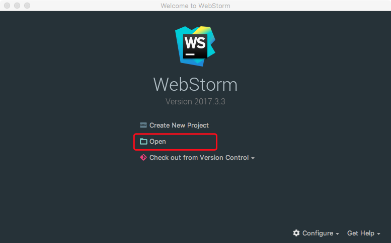
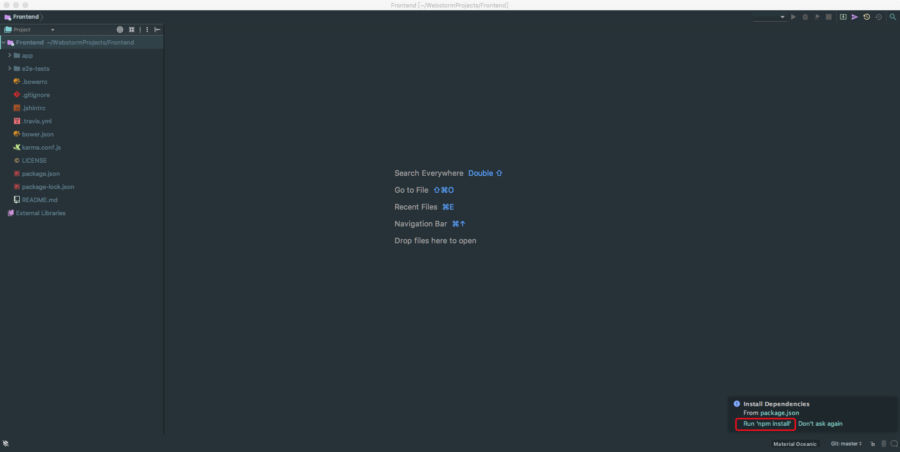
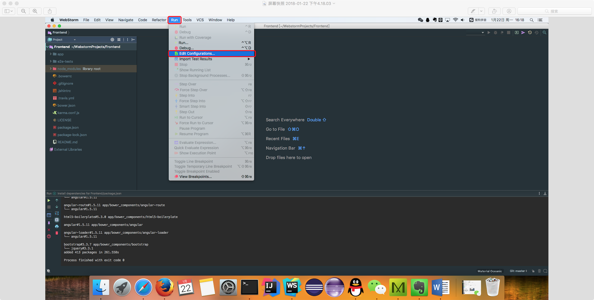
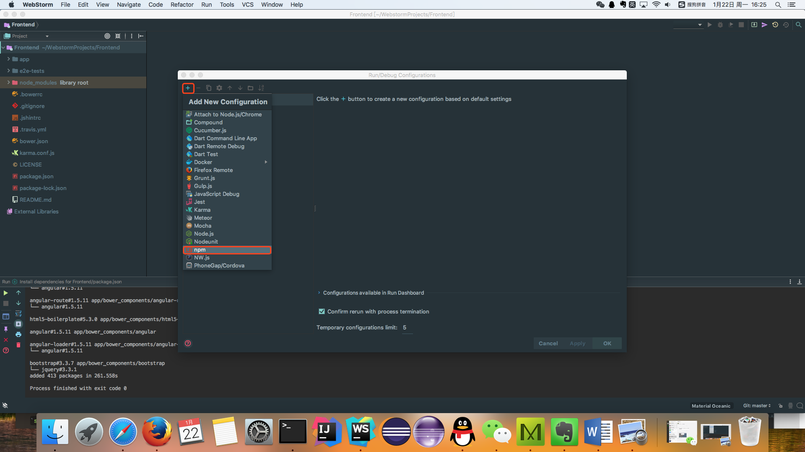
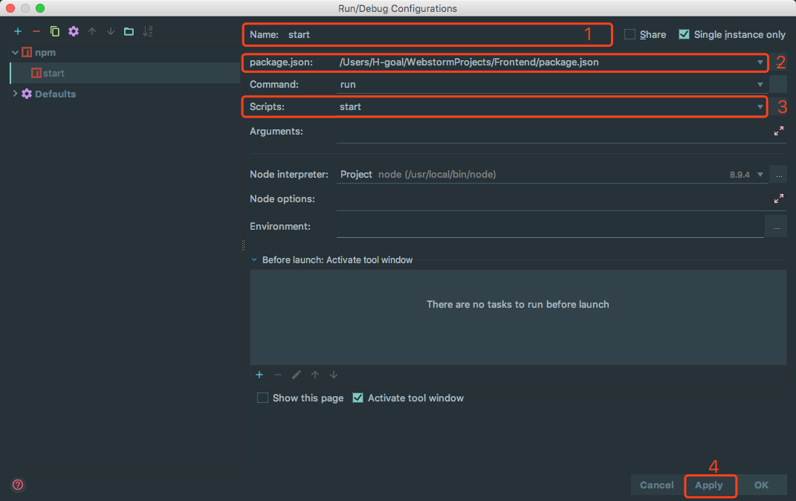
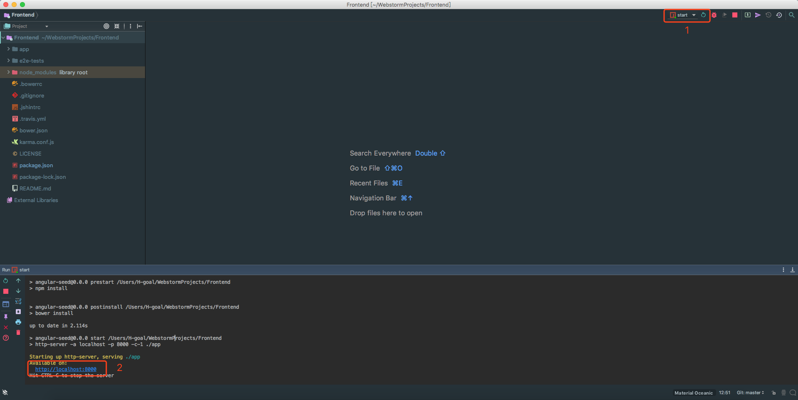
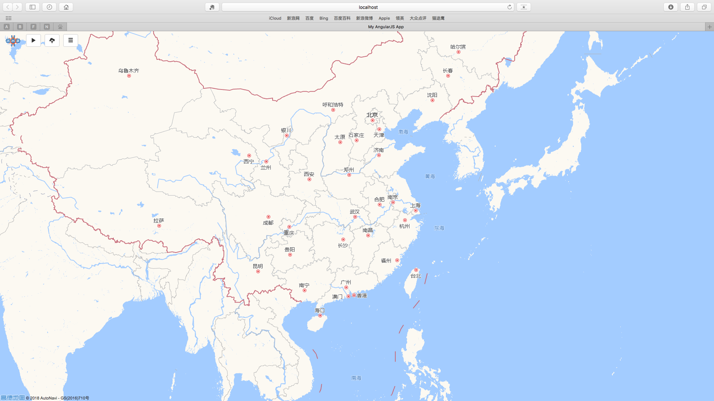

# README
## Table Of Contents
-   [Demo](#demo)
-   [Run in WebStorm](#run-in-webstorm)

## Demo
[demo video in dropbox](https://www.dropbox.com/s/gi2rrvfkl17vlng/vessel.mp4?dl=0)

## Run in `WebStrom`
1.  Download development tool:

    IDE: [WebStrom](http://www.jetbrains.com/webstorm/)
    
    Node.js 8.9.4LTS [Node.js](https://nodejs.org/en/)

2.  Clone Source Code:

    `git clone --recursive git@github.com:sonnyhcl/Frontend.git`

3.  Open Project in WebStrom:  
    -   Choose `Open Project`
    -   Choose the `directory path` which you clone the source code
    
    -   Choose `run npm install` Wait for npm to download dependencies
    

4.  Edit Configuration:
    -   Click `Run`
    -   Choose `Edit Configuration`
    
    -   Click the `+` in left-up corner
    -   Choose `npm`
    
    -   Configure npm settings
    
    
5.  Run Application:
    -   Run Angular Application and visit [http://localhost:8000](http://localhost:8000) in the browser
    
    

## Dependencies
-   [`Vessel Backend`](https://www.github.com/sonnyhcl/Backend/tree/lambda)
    
    > Attention: In order to perform as [demo](#demo) shows, The `Activiti Backend` project must be coordinated with the `Vessel Backend` project.

-   [`Coordinator`](https://github.com/sonnyhcl/coordinator)

    This repo simulates aws lambda locally.